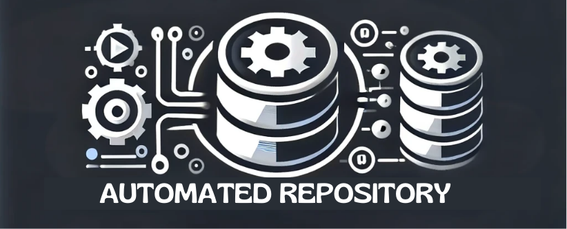
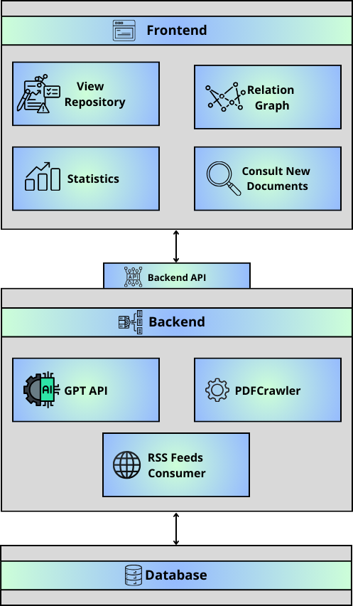
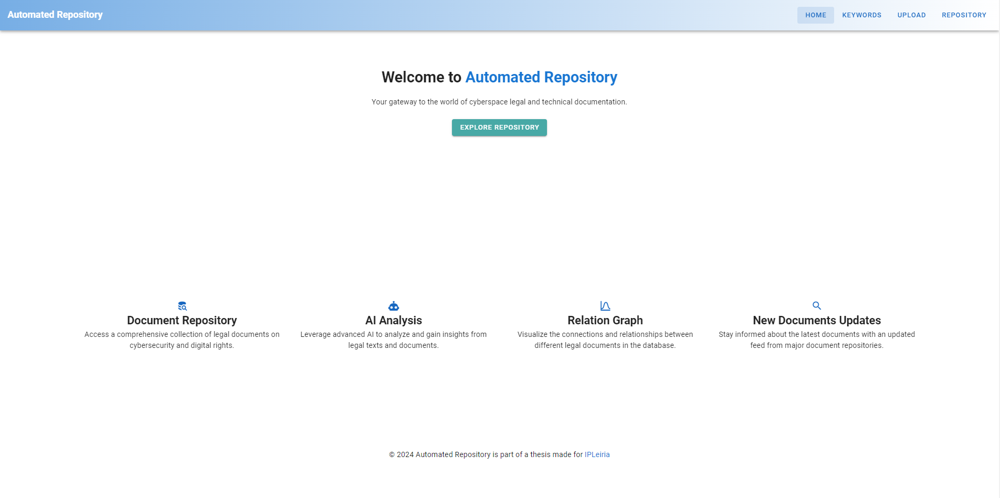
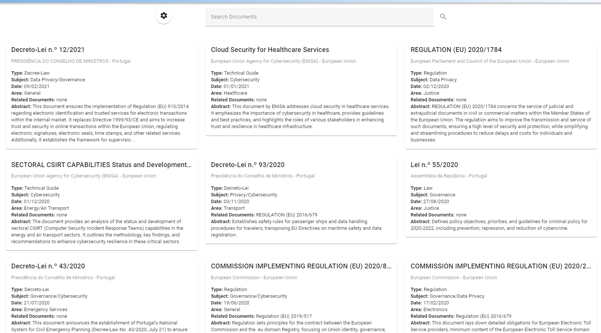
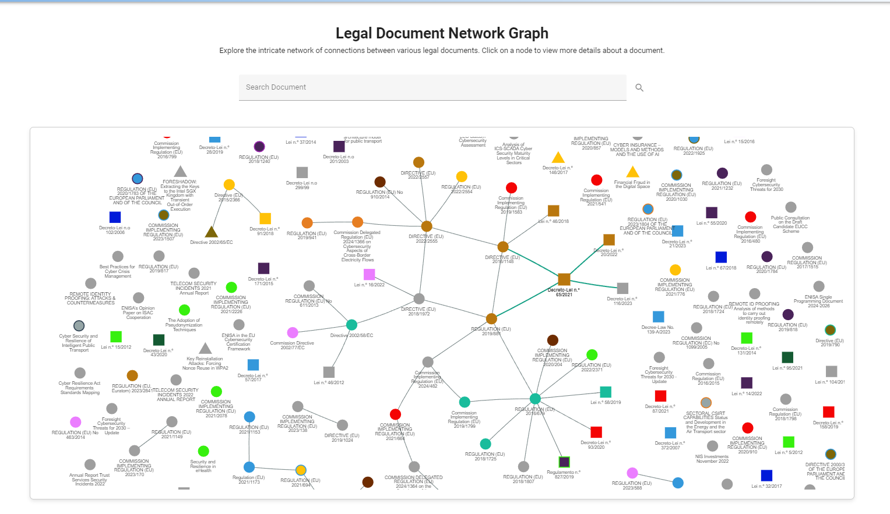
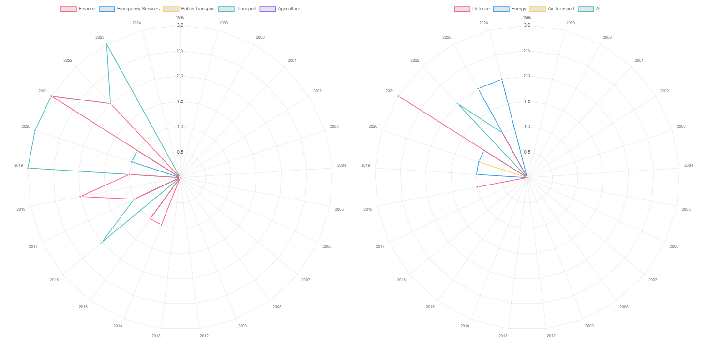

# Automated Repository


The Automated Repository is a project developed to enable automatic document collection, filtering, and classification using various tools, including GPT-4o. This project counts with an RSS Feed Consumer module and a PDF Crawler to efficiently gather documents from various sources. GPT-4o helps in filtering relevant documents according to the intended theme. For each document, it extracts information, organizes it according to several parameters, and generates insights about each one.
Document information and repository management are facilitated by an intuitive UI featuring various graphs and menus. Automated Repository is currently configured to collect and analyze cybersecurity related legislation and documentation.

## Features

- **RSS Feed Consumer**: Automatically collects documents from subscribed RSS feeds.
- **PDFCrawler**: Extracts PDF documents from online repositories. (Based on [SimFin PDFCrawler GitHub project](https://github.com/SimFin/pdf-crawler/tree/master))
- **Document Filtering**: Filters collected documents to ensure relevance within the defined theme.
- **Document Classification**: Utilizes GPT to classify and extract essential information from documents, such as:
  - Title
  - Date
  - Issuer
  - Origin
  - Area
  - related documents
  - Generation of short, informative abstracts

## Technology Stack

- **Frontend**: Vuetify 3
- **Backend**: Flask
- **Database**: MongoDB
- **OpenAI's GPT Models**: GPT-4o and GPT-4o Mini

## Project Overview



## Frontend Screenshots






## Getting Started

To get started with the Automated Repository, follow these steps:

### Pre-requisites

**Recommended:**
- **Windows 11:** 8 GB RAM Recommended.
- **Ubuntu 22.04 Desktop:** 8 GB RAM Recommended.

**Required:**
- **Python 3.x** (3.10+ Recommended) and pip: [Download Python](https://www.python.org/downloads/)
- **MongoDB**: [Download MongoDB](https://www.mongodb.com/) (MongoDB Compass Recommended)
- **Node.js** (20.10 Recommended): [Download Node.js](https://nodejs.org/en/download/package-manager)

**Not required for installation but needed to fully operate the Automated Repository:**
- **Geckodriver** (the .exe needs to be installed in the root folder of the project): [Download Geckodriver](https://github.com/mozilla/geckodriver/releases)
- **Firefox browser**: [Download Firefox](https://www.mozilla.org/pt-PT/firefox/new/)
- **OpenAI API Key**: [Get OpenAI API Key](https://openai.com/api/)

**After fulfilling the pre-requisites, run the following commands:**

**Clone the repository.**
   ```sh
   git clone https://github.com/yourusername/automated-repository.git
```
**Run the following, depending on the OS:**    
   **Windows:**
   - Run the setup executable to check pre-requisites, build environment files, and install pip and Node.js dependencies.
     ```sh
     setup_windows.exe
     ```
   - Start the Automated Repository application.
     ```sh
     AutomatedRepository_win.exe
     ```
  **Ubuntu**
  -  Run the setup script to check pre-requisites, build environment files, and install pip and Node.js dependencies.
     ```sh
     setup_linux.sh
     ```

   - Start the Automated Repository application.
     ```sh
     AutomatedRepository_Linux.sh
     ````
  
### Collected Documents
** THIS STEP IS OPTIONAL **

All documents gathered during the development of this project, along with their respective classifications, can be downloaded [here](https://drive.google.com/file/d/1rTfZbxoQLLzN686MScXfs-_cFXuLUOI5/view?usp=sharing). 

The link contains a complete copy of the project's database in JSON format, which can be uploaded to a MongoDB-managed database to replicate the final database used at the conclusion of the project.

### Known Issues - Ubuntu:
  - It may be necessary to rename geckodriver to geckodriver.exe.
  - If firefox browser was installed by default with Ubuntu, it may be necessary to remove it and re-install via apt. There is a known issue with firefox installed via snap and Selenium. We recommend this guide: [Resolve Issue With Firefox - Selenium](https://www.omgubuntu.co.uk/2022/04/how-to-install-firefox-deb-apt-ubuntu-22-04)
    
## Thesis Information

This project is part of a master thesis conducted at the [Instituto Politécnico de Leiria](https://www.ipleiria.pt/).


